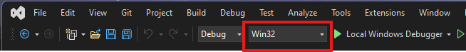
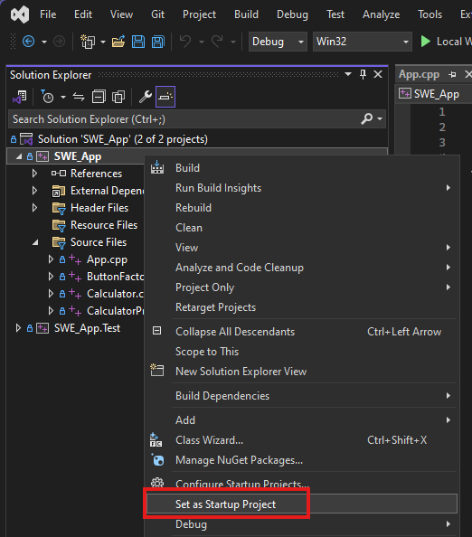

# Calculator
Calculator I created as part of Software Engineering at Full Sail University. Uses WxWidgets GUI library

## How to build

### Pre-requisites

- Visual Studio 2022
- vcpkg Package Manager (Should be installed by default with Visual Studio 2022)
- Windows 10 / 11

## Build & Run

- Switch the Active Solution Configuration to Win32:

- Right-click SWE-App -> Set as Startup Project

- Press F5

> Note: MSBuild should automatically download and install wx-widgets during the build